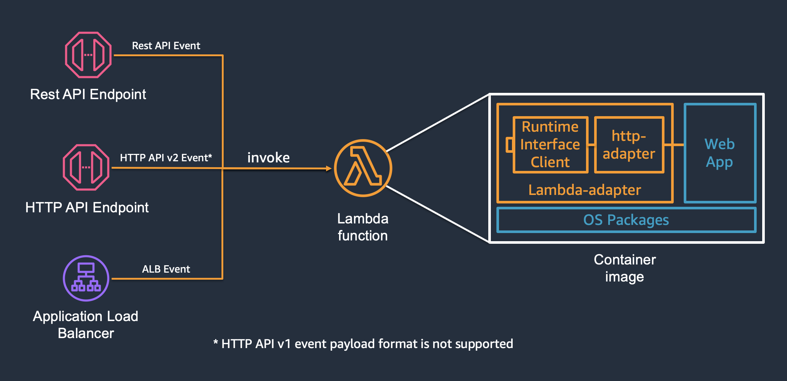

# AWS Lambda Adapter

A tool to run web applications on AWS Lambda without changing code.



## How does it work?

AWS Lambda Adapter supports AWS Lambda function triggered by Amazon API Gateway Rest API, Http API(v2 event format), and Application Load Balancer.
Lambda Adapter converts incoming events to http requests and send to web application, and convert the http response back to lambda event response.
When used outside of AWS Lambda execution environment, Lambda Adapter will just execute web application in the same process.
This allows developers to package their web application as a container image and run it on AWS Lambda, AWS Fargate and Amazon EC2 without changing code.

After Lambda Adapter launch the application, it will perform readiness check on http://localhost:8080/ every 10ms.
It will start lambda runtime client after receiving 200 response from the application and forward requests to http://localhost:8080.


## How to build it?

AWS Lambda Adapter is written in Rust and based on [AWS Lambda Rust Runtime](https://github.com/awslabs/aws-lambda-rust-runtime).
AWS Lambda executes functions in x86_64 Amazon Linux Environment. We need to compile the adapter to that environment.

### Clone the repo

First, clone this repo to your local computer.

```shell
$ git clone https://github.com/aws-samples/aws-lambda-adapter.git
$ cd aws-lambda-adapter
```

### Compiling with Docker
On x86_64 Windows, Linux and macOS, you can run one command to compile Lambda Adapter with docker.
The Dockerfile is [here](Dockerfile.x86). [AWS CLI v2](https://docs.aws.amazon.com/cli/latest/userguide/install-cliv2.html) should have been installed and configured.

```shell
$ make build
```

Once the build completes, it creates two docker images: 
- "aws-lambda-adapter:latest-x86_64" for x86_64.
- "aws-lambda-adapter:latest-aarch64" for arm64.

AWS Lambda Adapter binary is packaged as '/opt/bootstrap' inside each docker image. "aws-lambda-adapter:latest" is tagged to the same image as "aws-lambda-adapter:latest-x86_64". 

### Compiling on macOS

If you want to install rust toolchain in your Macbook and play with the source code, you can follow the steps below.
First, install [rustup](https://rustup.rs/) if you haven't done it already. Then, add targets for x86_86 and arm64:

```shell
$ rustup target add x86_64-unknown-linux-musl
$ rustup target add aarch64-unknown-linux-musl
```

And we have to install macOS cross-compiler toolchains. `messense/homebrew-macos-cross-toolchains` can be used on both Intel chip and Apple M1 chip.

```shell
$ brew tap messense/macos-cross-toolchains
$ brew install x86_64-unknown-linux-musl
$ brew install aarch64-unknown-linux-musl
```

And we need to inform Cargo that our project uses the newly-installed linker when building for the `x86_64-unknown-linux-musl` and `aarch64-unknown-linux-musl` platforms.
Create a new directory called `.cargo` in your project folder and a new file called `config` inside the new folder.

```shell
$ mkdir .cargo
$ echo '[target.x86_64-unknown-linux-musl]
linker = "x86_64-unknown-linux-musl-gcc"

[target.aarch64-unknown-linux-musl] 
linker = "aarch64-unknown-linux-musl-gcc"'> .cargo/config
```

Now we can cross compile AWS Lambda Adapter.

```shell
$ CC=x86_64-unknown-linux-musl-gcc cargo build --release --target=x86_64-unknown-linux-musl --features vendored
$ CC=aarch64-unknown-linux-musl-gcc cargo build --release --target=aarch64-unknown-linux-musl --features vendored
```

Lambda Adapter binary for x86_64 will be placed at `target/x86_64-unknown-linux-musl/release/bootstrap`. 
Lambda Adapter binary for arm64 will be placed at `target/aarch64-unknown-linux-musl/release/bootstrap`. 

Finally, run the following command to package lambda adapter into two container images for x86_64 and arm64.

```shell
$ aws ecr-public get-login-password --region us-east-1 | docker login --username AWS --password-stdin public.ecr.aws
$ docker build -f Dockerfile.mac --build-arg ARCH=x86_64 -t aws-lambda-adapter:latest-x86_64 .
$ docker build -f Dockerfile.mac --build-arg ARCH=aarch64 -t aws-lambda-adapter:latest-aarch64 .
$ docker tag aws-lambda-adapter:latest-x86_64 aws-lambda-adapter:latest
```

When these commands complete successfully, you will have the following container images. 

- "aws-lambda-adapter:latest-x86_64" for x86_64.
- "aws-lambda-adapter:latest-aarch64" for arm64.
- "aws-lambda-adapter:latest" is the same as "aws-lambda-adapter:latest-x86_64".

## How to use it?

To use it, copy the bootstrap binary to your container, and use it as ENTRYPOINT.
Below is an example Dockerfile for packaging a nodejs application.

```dockerfile
FROM public.ecr.aws/lambda/nodejs:14
COPY --from=aws-lambda-adapter:latest /opt/bootstrap /opt/bootstrap
ENTRYPOINT ["/opt/bootstrap"]
EXPOSE 8080
WORKDIR "/var/task"
ADD extensions/ /opt
ADD src/package.json /var/task/package.json
ADD src/package-lock.json /var/task/package-lock.json
RUN npm install --production
ADD src/ /var/task
CMD ["node", "index.js"]
```

Line 2 and 3 copy lambda adapter binary and set it as ENTRYPOINT. This is the only configuration change required to run web application on AWS Lambda. No need to change the application code.

```dockerfile
COPY --from=aws-lambda-adapter:latest /opt/bootstrap /opt/bootstrap
ENTRYPOINT ["/opt/bootstrap"]
```

To support Graviton2, change `aws-lambda-adapter:latest` to `aws-lambda-adapter:latest-arm64`. 

The readiness check port/path and traffic port can be configured using environment variables.

|Environment Variable|Description          |Default|
|--------------------|---------------------|-------|
|READINESS_CHECK_PORT|readiness check port | 8080  |
|READINESS_CHECK_PATH|readiness check path | /     |
|PORT                |traffic port         | 8080  |

## Show me examples

4 examples are included under the 'examples' directory. Check them out, find out how easy it is to run a web application on AWS Lambda.

- [Flask](examples/flask)
- [Express.js](examples/expressjs)
- [SpringBoot](examples/springboot)
- [nginx](examples/nginx)

## Acknowledgement

This project was inspired by several community projects.

- [re:Web](https://github.com/apparentorder/reweb)
- [Serverlessish](https://github.com/glassechidna/serverlessish)

## Security

See [CONTRIBUTING](CONTRIBUTING.md#security-issue-notifications) for more information.

## License

This project is licensed under the Apache-2.0 License.
