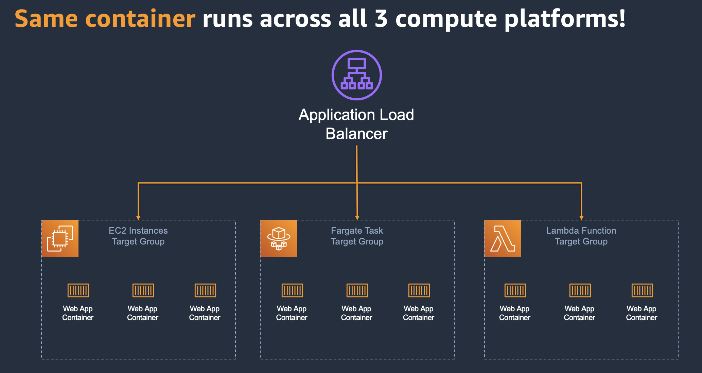
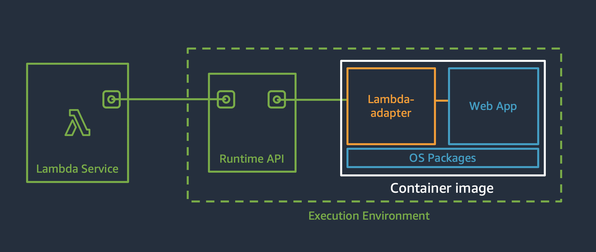

# AWS Lambda Adapter

Run web application containers on AWS Lambda, AWS Fargate and Amazon EC2 without changing code.



## How does it work?

AWS Lambda Adapter supports AWS Lambda function triggered by Amazon API Gateway Rest API, Http API(v2 event format), and Application Load Balancer.
Lambda Adapter converts incoming events to http requests and send to web application, and convert the http response back to lambda event response. 
When used outside of AWS Lambda execution environment, Lambda Adapter will just execute web application in the same process. 
This allows developers to package their web application as a container image and run it on AWS Lambda, AWS Fargate and Amazon EC2 without changing code.


After Lambda Adapter launch the application, it will perform readiness check on http://localhost:8080/ every 10ms.
It will start lambda runtime client after receiving 200 response from the application and forward requests to http://localhost:8080. 



## How to build it?

AWS Lambda Adapter is written in Rust and based on [AWS Lambda Rust Runtime](https://github.com/awslabs/aws-lambda-rust-runtime). 
You can use GNU Make to compiled as static linked binary and package as a docker image. A [Dockerfile](Dockerfile) including all the required rust tool chain and dependencies are used to build the tool.
[AWS CLI](https://aws.amazon.com/cli/) and [Docker](https://www.docker.com/get-started) are required to run the build.  

```shell
make build
```
This will create a docker image called "aws-lambda-adapter:latest". In this docker image, AWS Lambda Adapter is packaged as a file "/opt/bootstrap". 

## How to use it? 

To use it, copy the bootstrap binary from "aws-lambda-adapter:latest" to your container, and set it as ENTRYPOINT. 
Below is an example Dockerfile to package a nodejs application. 

```dockerfile
FROM public.ecr.aws/lambda/nodejs:14
COPY --from=aws-lambda-adapter:latest /opt/bootstrap /opt/bootstrap
ENTRYPOINT ["/opt/bootstrap"]
EXPOSE 8080
WORKDIR "/var/task"
ADD extensions/ /opt
ADD src/package.json /var/task/package.json
ADD src/package-lock.json /var/task/package-lock.json
RUN npm install --production
ADD src/ /var/task
CMD ["node", "index.js"]
```

The readiness check port/path and traffic port can be configured using environment variables. 

|Environment Variable|Description          |Default|
|--------------------|---------------------|-------|
|READINESS_CHECK_PORT|readiness check port | 8080  |
|READINESS_CHECK_PATH|readiness check path | /     |
|PORT                |traffic port         | 8080  |

## Show me examples

3 examples are included under the 'examples' directory. Check them out, find out how easy it is to run a web application on AWS Lambda. 

- [nginx](examples/nginx)
- [express.js](examples/expressjs)
- [SpringBoot](examples/springboot)


## Acknowledgement

This project was inspired by several community projects. 

- [re:Web](https://github.com/apparentorder/reweb)
- [Serverlessish](https://github.com/glassechidna/serverlessish)

## Security

See [CONTRIBUTING](CONTRIBUTING.md#security-issue-notifications) for more information.

## License

This project is licensed under the Apache-2.0 License.
